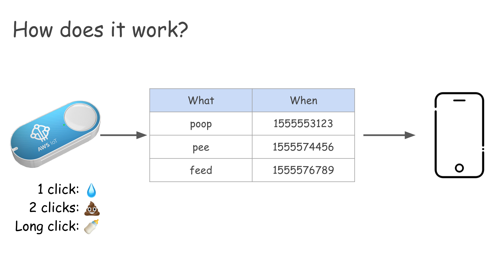

# Baby Tracker

When my kid was born, we were quickly told to keep track of a couple of things: when he'd breastfeed, pee and poop. Doctors use these 3 pieces of data to help debug babies. It's there on the checkin form when you go in for a regular checkup.

When we left the hospital, we started to take notes on a piece of paper, which we quickly questioned:

*[Me]*: There must be a better way to do that...

*[Wife]*: Oh, yeah. there are some apps that let you tra...

*[Me]*: Let me rephrase: there must be a better AND more fun way to do that...

So I set out to build this little tracker.

## How it Works
I wanted something easier than having to pull up our phone, open an app and press some buttons only to record an event. I wanted something easier to get to, some physical button that we could leave next to changing tables. After all, the only 2 things we need in the event are:
* what is it (pee, poop, feed)
* timestamp

The timestamp I can easily get from whatever system to save the data, and I figured I could condense the 3 event types into one single control, if said control allowed for different inputs.

And I knew just the perfect thing for this: that cool AWS IoT button.

So the idea is simple:
* I can have different IoT button clicks for different events.
* 1 click results means pee, 2 means poop and a long click means feeding.
* Whatever the button is connected to would grab the timestamp, the type of click and save that info to a table.
* A simple web app can then display that data, and we can quickly and easily keep track of his progress.
* Since the button requires WiFi, it won't work when we're out and about, so I also needed a way to input data through the web app.

## Architecture
And that's what I set out to build:

So not much of a secret here. I did add an auth layer to it, since I didn't want to leave that data, as well as the ability to edit it, too exposed.

## The UI
As for the UI, I needed a couple of features in it:
* a way to see how many times he had peed, pooped and fed in the past 24h (the doctor gave us some benchmarks)
* how long since any of these events happened
* a way to add a new event, and I could extend this w/ a date picker to allow us to add events that we didn't add through the button for whatever reason
* a way to remove events (probably just the last one, in case we did the wrong pressing of the button, for example)

So I landed on this:

## So that's it
I had a lot of fun working on this. It was mostly at nights, cause I was way too scared to sleep and not keep a watch on him. So I took the night shifts and would code away while everyone else slept. I'd have to wake up every 4h anyway to help my wife breastfeed, so might as well stay up and do something useful ¯\\\_(ツ)_/¯